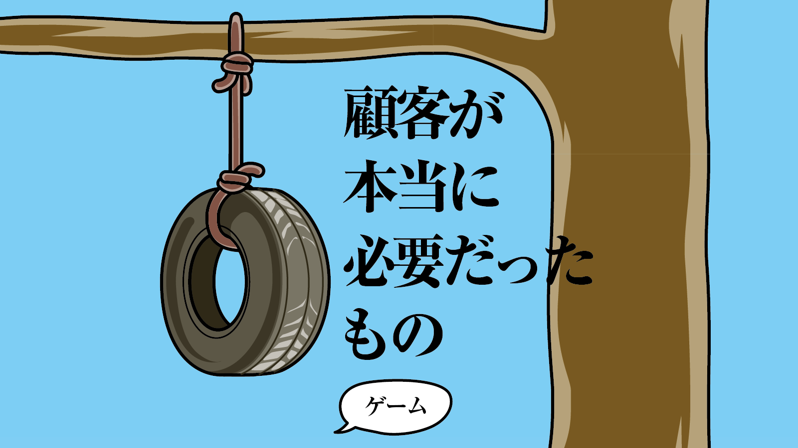
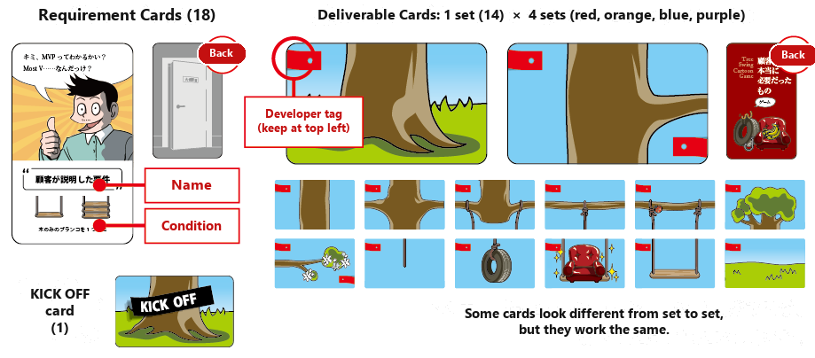
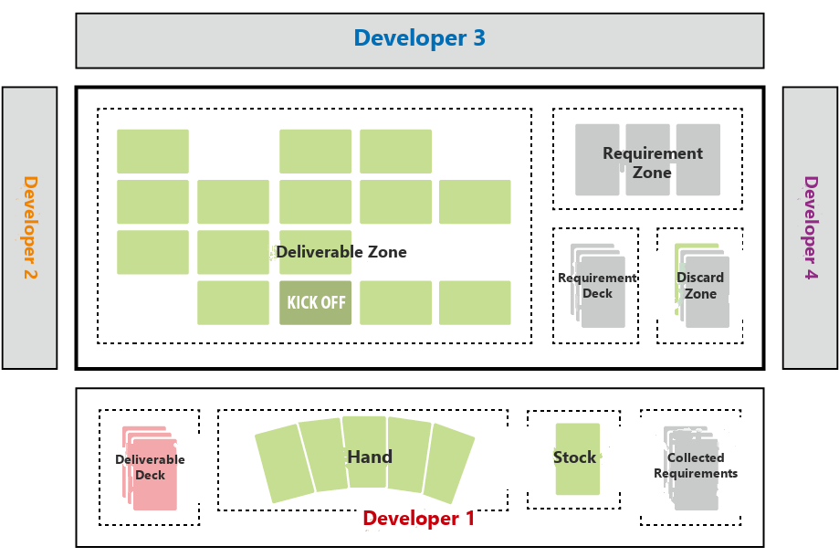
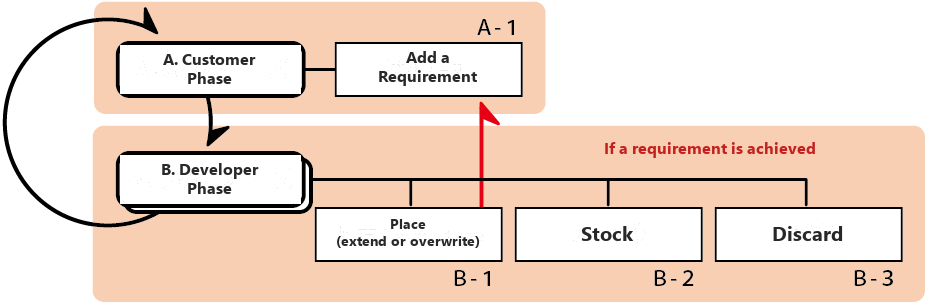

# Tree Swing Cartoon Game — Rules

What the Customer Really Needed

[日本語](./rule.html)

Players
: 2–4

Play time
: 20 minutes

Age
: 13+

## Introduction

You are a software developer assigned to the Tree Swing project. Read what the customer needs, and build the tree swing together with your colleagues.
The customers, though, will fire off wildly unreasonable demands.
Brush them off, pile up accomplishments, and finish by showing off how much you got done.

## What Is the Tree Swing Cartoon?

A satirical cartoon about IT system development, known in Japan as 「顧客が本当に必要だったもの」 ("What the Customer Really Needed"). It is said to be one of the parodies that grew out of an anonymous cartoon popular in the United States in the 1970s. In the mid-2000s it spread explosively across the Japanese internet. Its eight illustrations make the difficulty of communication in "building something with no physical form" painfully clear.

Reference: <http://dic.nicovideo.jp/id/4471118>

## Components

## Setup

**Prepare the requirement cards**

- Shuffle the requirement cards face down and place them in the center as the requirement deck.

**Prepare the deliverable cards**

- Deal one set of deliverable cards to each developer.
- Shuffle them well, face down, and place a deliverable deck in front of each developer.
- Draw the top 5 cards. This is your hand.

**Prepare the deliverable zone**

- Place the KICK OFF card face up in the deliverable zone.

**Choose the starting developer**

- The developer most recently banned by a customer is the starting developer.

## How to Play

After the customer phase, each developer takes a developer phase in clockwise order.
From then on, a customer phase occurs every time play goes all the way around.

### A. Customer Phase

The starting developer carries out the customer phase.

**A-1: Add a requirement**

- Draw the top card of the requirement deck and place it face up in the requirement zone.
- If that requirement has already been achieved, discard the card and draw a new one.
- If the requirement deck is empty, skip adding a requirement.

### B. Developer Phase

- Draw the top card of your deliverable deck and add it to your hand.
- Choose one card from your hand and either **place** it, **stock** it, or **discard** it.

**B-1: Place**

- Placing is either an extension or an overwrite.
  - **Extend**: Place a new card adjacent to a card already on the board.
  - **Overwrite**: Place a card on top of a card already on the board.
    - You may not overwrite the KICK OFF card. The card's color, and whether it is yours or another developer's, do not matter.
- A placement must satisfy both of the following:
  - Every edge that touches another card connects without a contradiction.
    - Trunk, branch, rope, and ground must connect. An edge that shows only sky may not touch another card.
  - Gravity is not contradicted.
    - A card may be placed only in the orientation that puts the developer tag at the top left.
- If you have a stocked card, you may place it at the same time. The card from your hand and the stocked card do not have to be next to each other.
  - You cannot place the stocked card by itself. If you use it, you must place two cards in total.

**Achieving requirements**

- If placing deliverable cards achieves a requirement card in the requirement zone, you take that requirement card.
- If several requirements are achieved at once, you take all of them.
- Then perform "Add a requirement" (A-1) once for each card you took.

**B-2: Stock**

- You may set aside one card from your hand for a later turn.
- Declare "Stock" and place the card face up in front of you.
- A stocked card can be played together with a placement (B-1).
- Each developer may have only one stocked card. If you already have one, you cannot stock another.

**B-3: Discard**

- Discard one card from your hand face up into the discard zone.

**End of the round**

- The round ends at the end of the turn on which every developer's deliverable deck runs out (turn 9).
- Score as follows. The unit is YTK (yatta-kan: that "I totally pulled it off" feeling).
  - 1 YTK for each of your cards still on the board that belongs to a connected group of 2 or more of your cards.
  - 1 YTK for each requirement card you collected.
- Honor the developer with the most YTK as the Client Whisperer.

## Optional rules

- A game is normally one round. You may instead play as many rounds as there are developers.
- After a round ends, pass the role of starting developer one seat clockwise and play the next round.
- The game ends once the starting developer has gone all the way around. The developer with the highest total YTK is the Legendary Client Whisperer.
