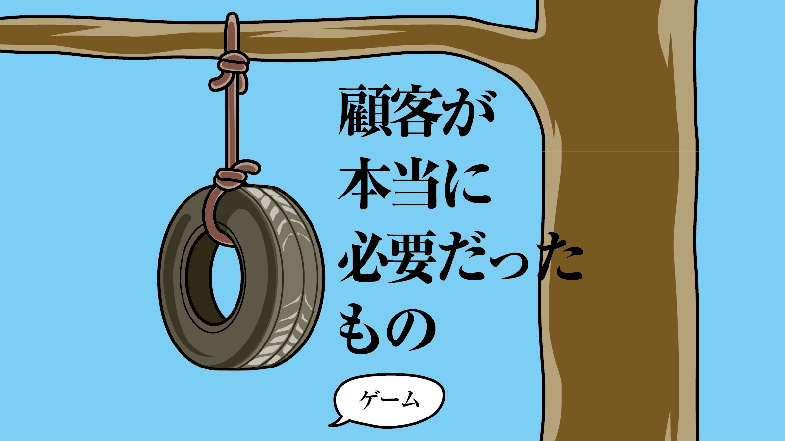
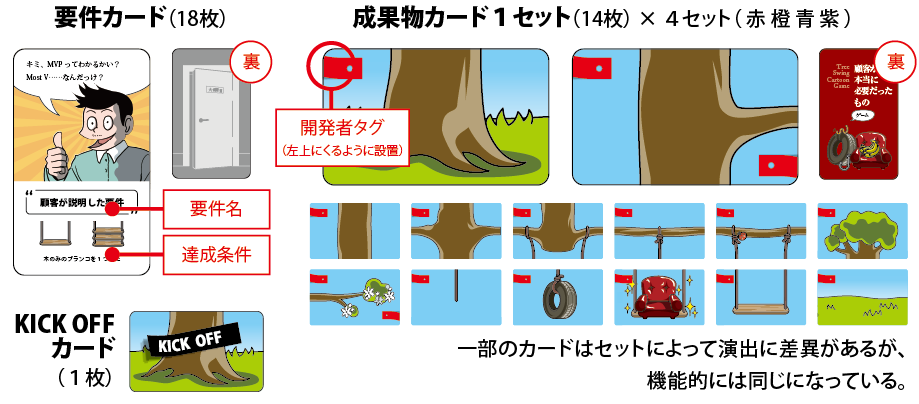
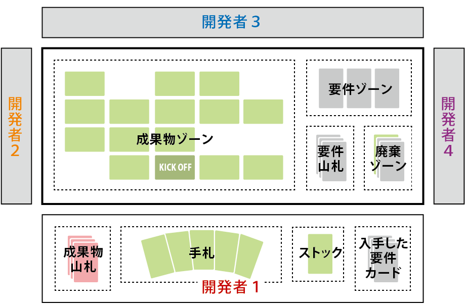
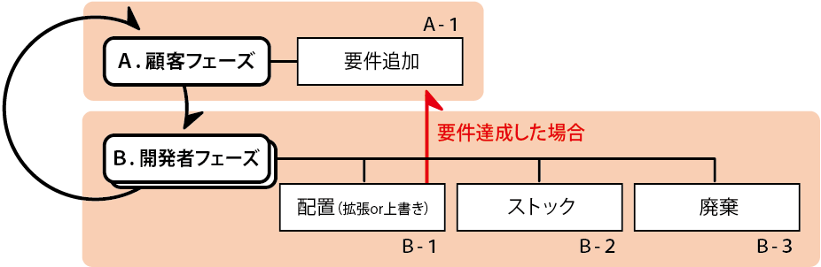

# 顧客が本当に必要だったものゲーム ルールページ

プレイ人数
: 2～4名

プレイ時間
: 20分

対象年齢
: 13歳～

## はじめに

あなたは「ブランコの木」開発プロジェクトにアサインされたシステム開発者です。顧客の要件を汲み取って「ブランコの木」を同僚とともに作り上げていきましょう。
しかし、顧客たちは好き勝手にメチャクチャな要求を繰り出してきます。
それらを軽くいなしながら、功績を積み上げ、最後にやった感をアピールしてください。

## ブランコの木（Tree Swing Cartoon） とは

日本では「顧客が本当に必要だったもの」と呼ばれているＩＴシステム開発の風刺画。元は1970年代アメリカで流行していた作者不詳の風刺画で、そこから生まれたパロディのひとつと言われている。日本では2000年代中盤にインターネットを中心に爆発的な広がりをみせた。８枚のイラストからは、ＩＴシステム開発という「形のないものづくり」におけるコミュニケーションの難しさがありありと伝わってくる。

参考URL: <http://dic.nicovideo.jp/id/4471118>

## 内容物（カード説明）

## ゲームの準備

**要件カードの準備**

- 要件カードを裏向きにシャッフルし、中央に要件山札を作る。

**成果物カードの準備**

- 各開発者に成果物カードを1セットずつ配る。
- 裏向きによくシャッフルし、各開発者の前に成果物山札を作る。
- 上から5枚を引き、手札とする。

**成果物ゾーンの準備**

- 成果物ゾーンにKICK OFFカードを表向きに置く。

**スタート開発者の決定**

- 一番最近、顧客に出禁になった開発者をスタート開発者とする。

## ゲームの進行

顧客フェーズのあとに、開発者それぞれの開発者フェーズを時計回りに順番に行う。
以降、手番が1周するごとに、顧客フェーズが行われる。

### A. 顧客フェーズ

※顧客フェーズの処理は、スタート開発者が実施する。

**Ａ-１： 要件追加**

- 要件山札の上から１枚を引き、要件ゾーンに表向きに置く。
- すでに達成されている要件だった場合、そのカードを廃棄し、新しく１枚を引き直す。
- 要件山札が０枚の場合、要件追加はスキップする。

### B. 開発者フェーズ

- 自分の成果物山札の上から１枚引き、手札に加える。
- 手札からカード１枚を「配置」「ストック」「廃棄」のいずれかを行う。

**Ｂ-１： 配置**

- 配置には「拡張」と「上書き」がある。
  - **拡張**：すでに配置されているカードに隣接するように、新規にカードを配置する。
  - **上書き**：すでに配置されているカードの上に、カードを重ねて配置する。
    - ※ただし、KICK OFFカードを除く。カードの色、自他は問わない。
- 配置は、２つの条件をともに満たしている必要がある。
  - 他のカードと隣接するすべての辺に矛盾がないこと
    - （幹、枝、紐、地面がつながっていること。空のみの隣接はＮＧ）
  - 重力の方向に矛盾がないこと
    - （左上に開発者タグがくる向きでのみ配置可能）
- ストックが存在する場合、ストックを同時に配置することができる。手札から出すカードとストックの配置場所は、離れていても問題ない。
  - ※ストックカードのみの配置はできない。ストックカードを使う場合は、必ず合計２枚配置する。

**要件の達成**

- 成果物カードを配置したことで、要件ゾーンに置かれているいずれかの要件カードが達成された場合、その要件カードを手に入れる。
- 同時に複数の要件が達成された場合、達成された要件カードすべてを手に入れる。
- その後、達成された枚数分の「要件追加」（Ａ-１）を行う。

**Ｂ-２： ストック**

- 手札から1枚を次ターン以降のためにストックしておくことができる。
- 「ストック」を宣言し、自分の前に表向きに置く。
- ストックしたカードは、「配置」（Ｂ-１）のタイミングで同時に使うことができる。
- ストックは１開発者１枚まで。すでにストックが存在する場合は、ストックすることができない。

**Ｂ-３： 廃棄**

- 手札から１枚を表向きにして廃棄ゾーンに捨てる。

**ラウンドの終了**

- 全開発者の成果物山札がなくなったターン（９ターン）の終了時にラウンド終了となる。
- 以下にしたがって、得点計算を行う（単位：ＹＴＫ＝やった感）。
  - 最後に盤面を占めている自分のカードのうち、２枚以上隣接してかたまりになっているもの１枚につき１ＹＴＫ
  - 入手した要件カード１枚につき１ＹＴＫ
- 一番多くのＹＴＫを集めた開発者を「顧客の達人」として讃えよう。

**オプションルール**

- 通常は１ラウンドだが、開発者の人数分ラウンドを行う。
- ラウンド終了後、スタート開発者を時計回りに動かして、次ラウンドを行う。
- スタート開発者が１周したら、ゲーム終了。合計ＹＴＫで「真・顧客の達人」を決める。
